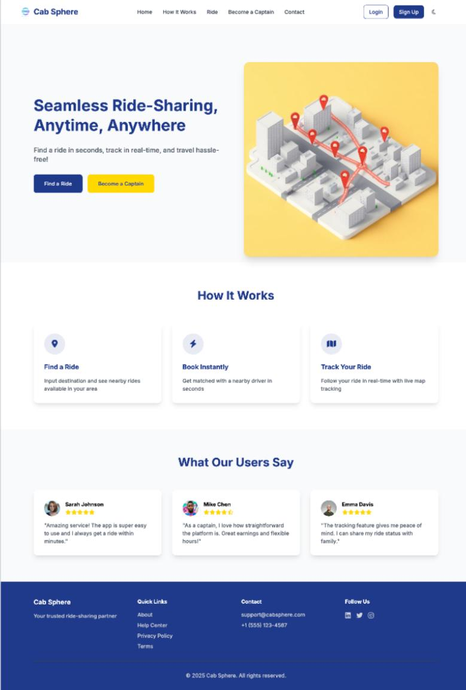
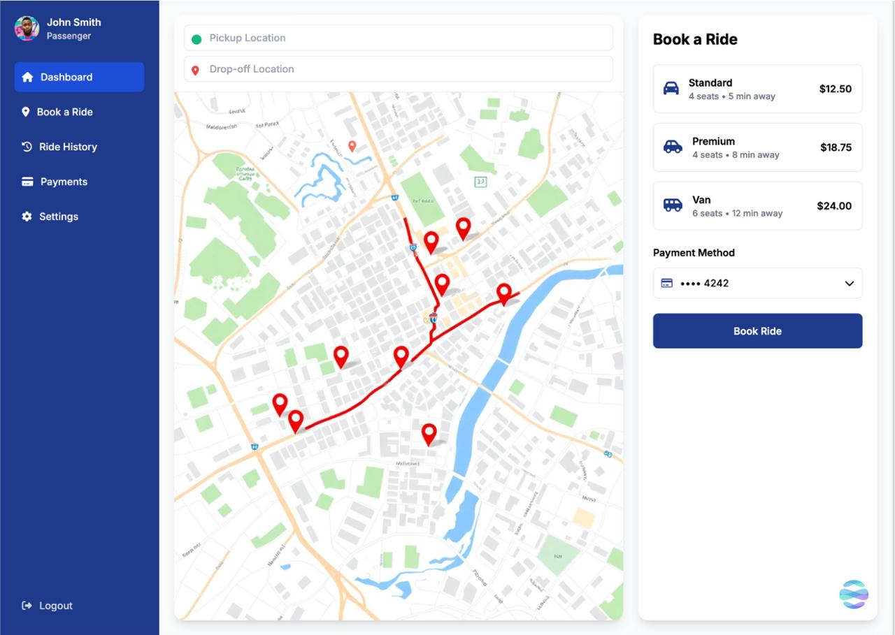
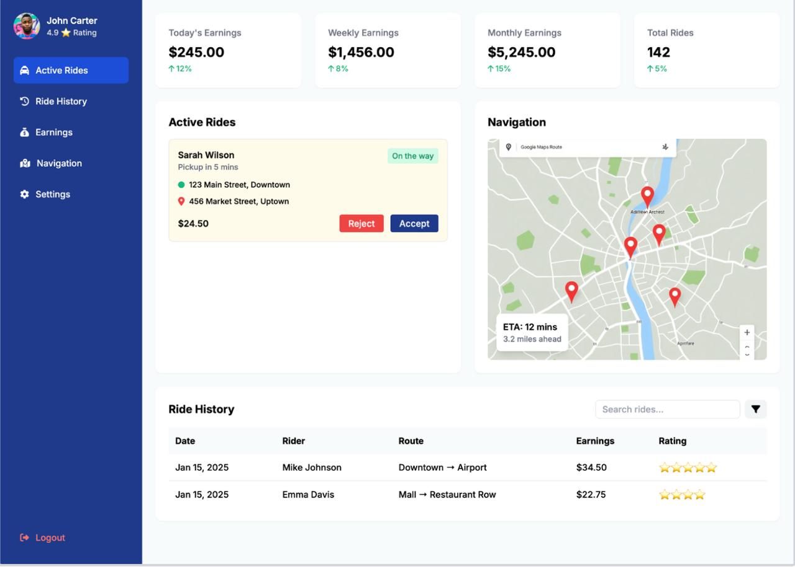

# 🚖 Cab Sphere

A **MERN-based ride-sharing platform** integrated with **Firebase Authentication**, **Google Maps API**, and **Mapbox** to provide a seamless and efficient ride-booking experience.

## 🌟 Key Features

### 🔐 Secure Authentication & Session Management
- Integrated **Firebase Authentication** to enable **secure login** for both **riders and captains**.
- Enhanced session management to **reduce login failures by 20%**, ensuring a smoother experience.

### 🗺️ Real-Time Ride Tracking & Routing
- Implemented **Google Maps API** and **Mapbox** for **precise geolocation**, **optimized route suggestions**, and **distance estimation**.
- Improved **ride-matching efficiency by 25%**, minimizing waiting time and improving route accuracy.
- Riders can **track their ride in real-time**, enhancing transparency and trust.

### 🚗 Rider & Captain Dashboards
- **Rider Dashboard**: Enables users to book rides, view available captains, check estimated fares, and track their journey live.
- **Captain Dashboard**: Allows drivers to **accept ride requests**, view real-time navigation, and manage ride history.

### 📊 Advanced Backend & Database Management
- **MongoDB** stores **user, ride, and captain details**, ensuring efficient and scalable data handling.
- **Express.js & Node.js** power the backend, facilitating seamless communication between the frontend and database.

### 📱 Intuitive User Interface
- **React.js frontend** ensures a smooth, responsive, and interactive experience for both **riders and captains**.
- Sleek **UI/UX** for effortless ride booking and management.

## 🚀 Tech Stack

| Technology      | Usage                         |
|----------------|------------------------------|
| **MongoDB**    | Database for storing ride, user, and captain data |
| **Express.js** | Backend framework for API endpoints |
| **React.js**   | Frontend UI for riders and captains |
| **Node.js**    | Server-side logic and API handling |
| **Firebase Auth** | Secure authentication and session management |
| **Google Maps API** | Geolocation and distance estimation |
| **Mapbox** | Enhanced maps and routing |

## 📸 Screenshots & Feature Overview

### 🏠 Landing Page – Seamless Ride-Sharing Experience

The **landing page** serves as the first touchpoint for users. It highlights the platform’s core functionality, allowing users to either **find a ride** as a passenger or **become a captain (driver)**. The UI is designed to be clean and engaging, ensuring new users can navigate effortlessly.

- **Quick Access to Booking:** Users can immediately start the booking process.
- **How It Works Section:** Briefly explains the steps involved in using the platform.
- **User Testimonials:** Displays feedback from real users, enhancing credibility.

---

### 🚗 Rider Booking Dashboard – Real-Time Ride Selection & Booking

The **rider dashboard** provides a powerful yet simple interface to **book rides in real time**.

- **Interactive Map View:** Displays the route and available drivers using **Google Maps API & Mapbox**.
- **Pickup & Drop-Off Location Fields:** Allows users to enter their destinations effortlessly.
- **Multiple Ride Options:** Riders can choose between **Standard, Premium, and Van rides**, each with different pricing and wait times.
- **Secure Payment Integration:** Users can pay directly through the platform with saved payment methods.

The real-time route display ensures riders can **visualize their trip before confirming**, enhancing transparency and trust.

---

### 🚖 Captain Dashboard – Managing Rides, Earnings & Navigation

The **captain dashboard** is designed for drivers, providing essential tools to **accept rides, track earnings, and navigate efficiently**.

- **Ride Requests in Real Time:** Captains can view new ride requests and **accept or reject** them.
- **Earnings Dashboard:** Displays **daily, weekly, and monthly earnings**, offering clear financial tracking.
- **Navigation Panel:** Integrated **Google Maps routing** provides optimal paths to pickup and drop-off locations.
- **Ride History & Ratings:** Captains can access past rides and review ratings received from passengers.

This dashboard enhances **captains' workflow**, ensuring smooth and efficient ride management.

---
